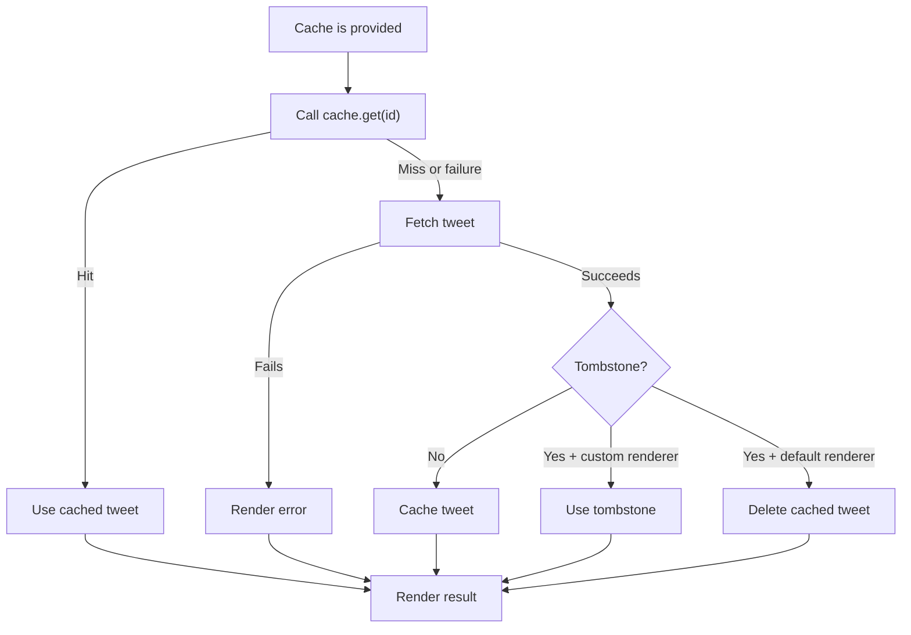

import { Xitter } from 'astro-xitter';
import { Aside, Tabs, TabItem } from '@astrojs/starlight/components';

Astro Xitter uses Twitter's Syndication API to fetch tweet data which will then used to render Tweet or [passed to a custom rendering pipeline](/guides/custom-rendering).

However, continuous and many API traffic might result in Twitter API applying rate limit to your application, which will break the tweet rendering pipeline.

To avoid rate-limiting, Astro Xitter accepts an additional prop `cache` that lets you define cache mechanism that will be used to fetch tweet data.

```astro
---
import { Xitter } from 'astro-xitter';

// extremely simple cache implementation
const container = new Map();
const cache = {
  async get(id) {
    return container.get(id);
  },

  async set(id, tweet) {
    container.set(id, tweet);
  },

  async delete(id) {
    container.delete(id);
  },
};
---

<Xitter id="<TWEET_ID>" cache={cache} />
```

This property is designed to be optional. If the `cache` prop is not provided, data fetching will completely ignore caching mechanism and fetchs
data as usual.

### How Cache Is Used

The following diagram illustrates tweet data fetching flow when `cache` is present:



### API Reference

The `cache` prop accepts an object that implements the `XitterCache` interface. The `XitterCache` interface have 3 methods:

```ts
type MaybePromise<T> = T | PromiseLike<T>;

export interface XitterCache {
  get: (id: string) => MaybePromise<Xitter | undefined>;
  set: (
    id: string,
    entry: Xitter,
  ) => MaybePromise<void>;
  delete?: (id: string) => MaybePromise<void>;
}
```

Below is an example implementation of `XitterCache` that uses in-memory `Map` with TTL support

```ts
import type { XitterCache } from 'astro-xitter';

const cache = new Map<string, { tweet: any; expires: number }>();
// 15 minutes expiration time
const ttl = 15 * 60 * 1_000;

export const xitterCache: XitterCache = {
  async get(id) {
    const entry = cache.get(id);

    if (!entry || entry.expires < Date.now()) {
      cache.delete(id);
      return undefined;
    }

    return entry.tweet;
  },

  async set(id, tweet) {
    cache.set(id, {
      tweet,
      expires: Date.now() + ttl,
    });
  },

  async delete(id) {
    cache.delete(id);
  },
};
```
